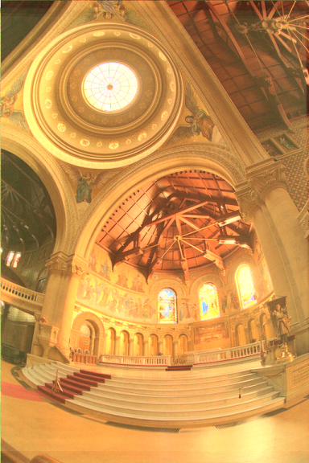
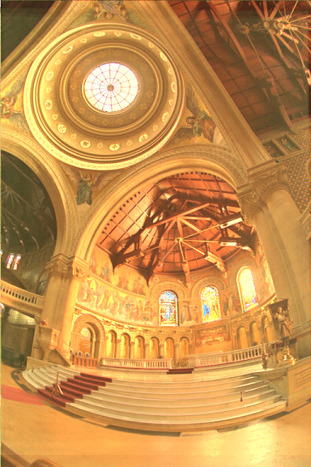

# HDR

The aim of this project was to implement the photographic imaging techniques, including HDR imaging and tone mapping. The HDR image was created by followed steps:

1. Images alignment by Median Threshold Bitmap
2. HDR radiance map recovering by [Paul E. Debevec method](http://www.pauldebevec.com/Research/HDR/debevec-siggraph97.pdf)
3. Tone mapping by [Reinhard's global and local operators](http://www.cmap.polytechnique.fr/~peyre/cours/x2005signal/hdr_photographic.pdf)

# Results:
## Response Curve:

## Radiance Map:

## Tone mapping :

The difference between Reinhard’s local and global tone mapping operators is dodging and burning process which could increase contrast by pixel-wise manipulation. The results of local tone mapping after dodging and burning made the lines in the light darker. 

| Global | Local |
|:---:|:---:|
|||

## My HDR photo

# Reference

[Recovering High Dynamic Range Radiance Maps from Photographs, Paul E. Debevec, Jitendra Malik, 1997.](http://www.pauldebevec.com/Research/HDR/debevec-siggraph97.pdf)

[Photographic Tone Reproduction for Digital Images, Erik Reinhard *et al.*, 2002](http://www.cmap.polytechnique.fr/~peyre/cours/x2005signal/hdr_photographic.pdf)

High Dynamic Range Imaging: Acquisition, Display, and Image-Based Lighting, Erik Reinhard *et al.*, 2010. 

Advanced High Dynamic Range Imaging (2nd Edition), Banterle *et al.*, 2017. [[HDR Toolbox github]](https://github.com/banterle/HDR_Toolbox)
